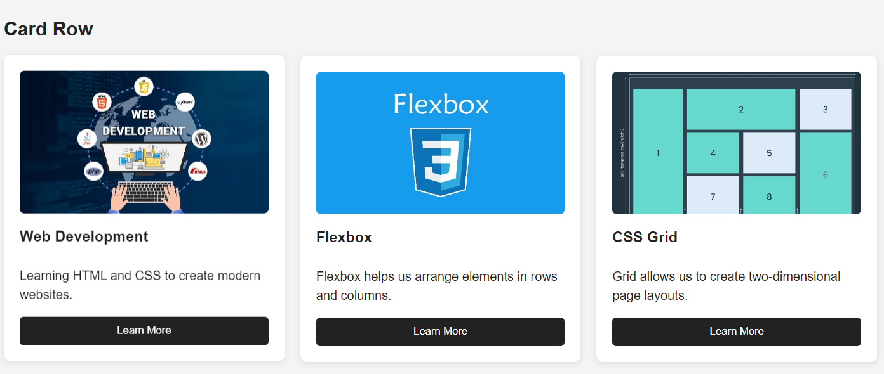
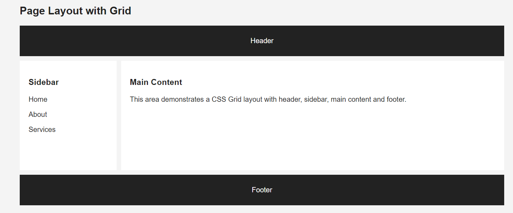
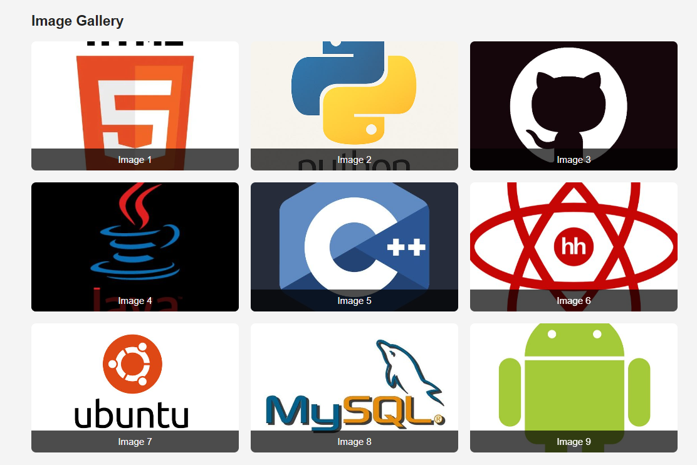
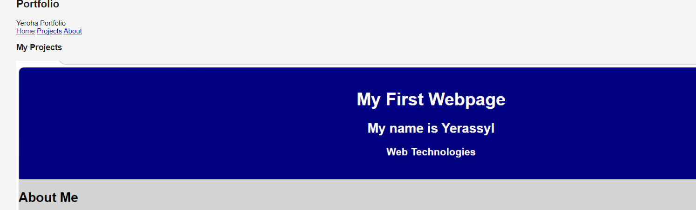

# Assignment 2 - Advanced CSS

## Student Information

Name: Yerassyl Nassypkeliyev  
Group: SE-2538

## Objective

The objective of this assignment is to practice advanced CSS layouts using Flexbox and CSS Grid.

## Task 0 - Navigation Bar

Created a navigation bar using Flexbox.

Features:
- Logo on the left
- Navigation links on the right
- Vertical alignment
- Spacing between links
- Hover effect

## Task 1 - Card Row

Created three cards using Flexbox.

Each card contains:
- Image
- Title
- Description
- Button
- Hover effect

## Task 2 - Page Layout with Grid

Created a page layout using CSS Grid.

The layout contains:
- Header
- Sidebar
- Main content
- Footer

Grid areas were used to organize the layout.

## Task 3 - Image Gallery

Created a gallery with 9 images using CSS Grid.

Features:
- Three equal columns
- Gaps between images
- Image captions
- Hover effect

## Task 4 - Portfolio

Created a portfolio page using both Flexbox and CSS Grid.

The page contains:
- Header
- Navigation
- Main content
- Projects
- Sidebar
- Footer

Flexbox is used inside the navigation and project cards.
Grid is used for the main page structure.

## Summary

This assignment helped me practice CSS Flexbox and Grid. 
I learned how to create one-dimensional and two-dimensional layouts,
align elements, create gaps, and build structured responsive pages.

## Screenshots

### Task 0

### Task 1

### Task 2

### Task 3

### Task 4
